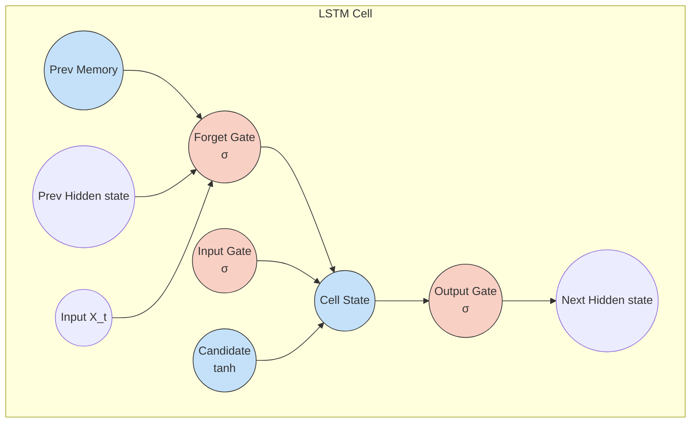
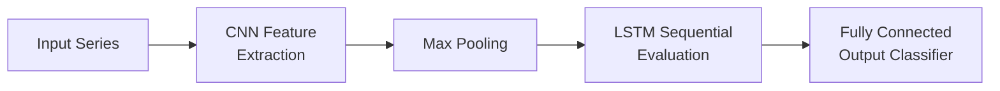

# CNN & LSTM Stress Detection Architecture

This repository contains a robust multi-model machine learning architecture for Physiological Heart Rate Variability (HRV) classification schemas. Evaluated architectures run in fully distributed Github Actions utilizing PyTorch.

## Evaluated Neural Architectures

### 1. 1D Convolutional Neural Network (CNN1D)
Provides robust temporal spatial mapping over vectors.

```mermaid
graph LR
    Input[Input Layer<br>Matrix fingerprints] --> Conv1[Conv1D<br>Filter: 512, Kernel: 3]
    Conv1 --> Pool1[Max Pooling]
    Pool1 --> Conv2[Conv1D<br>Filter: 256, Kernel: 3]
    Conv2 --> Pool2[Max Pooling]
    Pool2 --> Conv3[Conv1D<br>Filter: 128, Kernel: 3]
    Conv3 --> Pool3[Max Pooling]
    Pool3 --> Conv4[Conv1D<br>Filter: 64, Kernel: 3]
    Conv4 --> Pool4[Max Pooling]
    
    Pool4 --> FC1[Fully Connected<br>1024 Neurons<br>Dropout: 0.5]
    FC1 --> FC2[Fully Connected<br>512 Neurons<br>Dropout: 0.5]
    FC2 --> FC3[Fully Connected<br>256 Neurons]
    FC3 --> Sigmoid[Output<br>Multi-class neurons]
    
    style Input fill:#f9f,stroke:#333,stroke-width:2px
    style Sigmoid fill:#f9f,stroke:#333,stroke-width:2px
```



### 2. Long Short-Term Memory Network (LSTM)
Utilizes sequence-gates to interpret biological data sequentially.



### 3. Hybrid Convolutional LSTM (CNN+LSTM)
A pipeline extracting feature dependencies via convolutions sequentially decoded via LSTMs.



## Research Features
**Distribution Resampling / Augmentation**:
*   Baseline (Unbalanced Original Set)
*   SMOTE (Synthetic Minority Over-sampling Technique)
*   ADASYN (EnTDA proxy methods mapping variance synthetically)

**Fully Distributed Continuous Integration**:
*   Using GitHub Actions (`main.yml` strategy configurations), experiments are automatically run simultaneously in parallel.
*   Once datasets (SMOTE/ADASYN vs Normal) and Models are exhaustively trained, the artifacts are grouped.
*   The system consolidates isolated runs via `--aggregate` into `PROFESSIONAL_RESEARCH_REPORT.md` available as a unified workflow ZIP.

## Local Execution
Ensure your environment is constructed properly (requires PyTorch):

```bash
pip install -r requirements.txt
```

Kickstart the primary orchestrator that iterates all models automatically:

```bash
# Run the entire loop locally
python main.py

# Or run isolated instances to debug:
python main.py --model cnn_lstm --balancing smote
```
